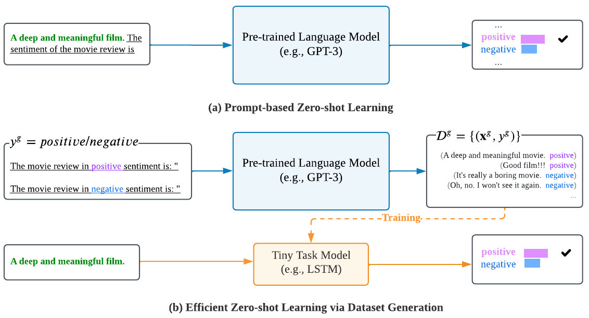

This repository contains the code for our paper [“ZeroGen: Efficient Zero-shot Learning via Dataset Generation”](https://arxiv.org/abs/2202.07922).

Our implementation is built on the source code from [dino](https://github.com/timoschick/dino). Thanks for their work.

If you use this code, please cite our paper:

```
@article{ye2022zerogen,
      title={ZeroGen: Efficient Zero-shot Learning via Dataset Generation}, 
      author={Jiacheng Ye and Jiahui Gao and Qintong Li and Hang Xu and Jiangtao Feng and Zhiyong Wu and Tao Yu and Lingpeng Kong},
      year={2022},
      eprint={2202.07922},
      archivePrefix={arXiv},
      primaryClass={cs.CL}
}
```

## Setup
All requirements for Z<small>ERO</small>G<small>EN</small> can be found in ``requirements.txt``. 
You can install all required packages in a new environment with ``pip install -r requirements.txt``.

## Usage
The `scripts/run_cls.sh` and `scripts/run_qa.sh` scripts contain the running commands for the following settings:
- supervised learning with human annotations (S<small>UPERVISED</small>)
- prompt-based zero-shot learning (P<small>ROMPTING</small>)
- efficient zero-shot learning via dataset generation (Z<small>ERO</small>G<small>EN</small>)

For text classification (TC) tasks (e.g., SST-2 and IMDb) and natural language inference (NLI) tasks (e.g., QNLI and RTE), run with `bash scripts/run_cls.sh`.
For question answering (QA) tasks, run with `bash scripts/run_qa.sh`

When generating X (i.e., denotes text in TC, hypothesis in NLI and question in QA) in the final stage of the scripts, we also train the small model and evaluate it on human annotations. 
Specifically, after generating `log_every` number of examples,  we perform training on the synthetic dataset and evaluation on the gold validation set. 
This gives as a trend graph similar to Figure 2 in the paper, which is shown by [wandb](https://wandb.ai/site), a powerful toolkit to track experiments.
 
Before running, you need to reset the following parameters to yours:
- `home_dir`: path to `ZeroGen`
- `gpu`: gpu id
- `batch_size`: the batch size for generating with PLM. For SST-2, it costs ~16G when using a batch size of 32 with gpt2-xl. While for SQuAD, it costs ~60G using the same batch size and PLM because of the longer contexts. So decrease the batch size if needed. 
- `WANDB_PROJECT`: project name, by default `ZeroGen`
- `WANDB_ENTITY`: your wandb username
- `WANDB_API_KEY`: your api-key

By default we use GPT2-XL as pre-trained language model (PLM) and DistilBERT as tiny-task model (TAM), 
to modify the size of PLM and TAM, you can change `model_name` and `small_model_name` in `run_xxx.sh` scripts.

### Run with a synthesized dataset
After dataset generation, we save the synthetic dataset at:
- For TC and NLI: `out-${task_name}-x2/${dataset}/${task_name}-dataset.jsonl` (e.g., `out-sst-2-x2/gpt2-xl_topk0_topp0.9_sst-2-x2/sst-2-dataset.jsonl`). The file is in json line format (e.g., `{"C": "The Book of Mormon Musical", "X": "The Book of Mormon Musical brings all the drama and excitement of a real revival of the Broadway production to the big screen.", "Y": 0}`).
- For QA: `out-${task_name}-x2/${dataset}`. We save the dataset in huggingface [Dataset](https://huggingface.co/docs/datasets/index.html) format. 

To run DistilBERT given a generated dataset, you can use the `scripts/run_distilbert.sh` script. 

To run a LSTM-based model given a generated dataset, you can use the `scripts/run_cls_lstm.sh` script. 
Before that, you have to download the datasets from [google drive link](https://drive.google.com/file/d/11Iz3sXU6JMHIk2li95s7gHM1f7mb__Kl/view?usp=sharing), which contain the standard test files.

### Diversity and Correctness of a synthesized dataset
#### Divesity
We use Self-BLEU to measure the diversity of a synthesized dataset. To calculate the Self-BLEU for a given dataset, you can see the example in `scripts/run_self_bleu.sh` script.

#### Correctness
To calculate the Correctness, you can take the following steps:
1. Replace the following parameters in `scripts/run_distilbert.sh` script with:
    - `small_model_name=roberta-large`
    - `dataset=`: empty means using standard training set
    - `limit=`: empty means using full standard training set
    
    This will give you a RoBERTa-Large trained with full human annotations, which can be used as an evaluator. 
2.  Replace the following parameters in `scripts/run_distilbert.sh` script with:
    - `small_model_ckpt=tmp/checkpoint-xxx`: the final RoBERTa-Large checkpoint saved in step 1.
    - `limit=10000`: the number of samples to use, by default 10000
    - `dataset=xxx`: the name of synthetic dataset (e.g., `gpt2-xl_topk0_topp0.9_sst-2-x2`)
    - `no_train=true`: disable training
    
    Run the script, and you will get `Metric on standard dataset` and `Metric on synthetic dataset`, which represents the Correctness of standard dataset and synthetic dataset, respectively.  
    
### Resources
We provide some synthetic datasets and standard datasets for training LSTM in this [google drive link](https://drive.google.com/file/d/11Iz3sXU6JMHIk2li95s7gHM1f7mb__Kl/view?usp=sharing). 
When training DistilBERT, the standard dataset is directly downloaded by huggingface [Dataset](https://huggingface.co/docs/datasets/index.html) package.
Note we use the same prompt for IMDb/SST-2, and SQuAD/AdversarialQA, therefore the synthetic datasets are also the same.

